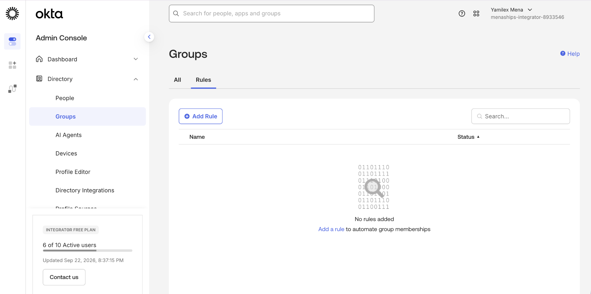
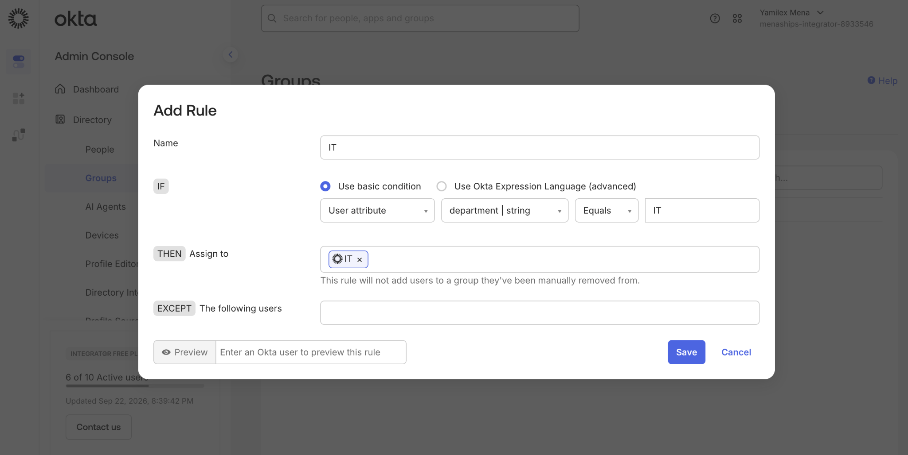
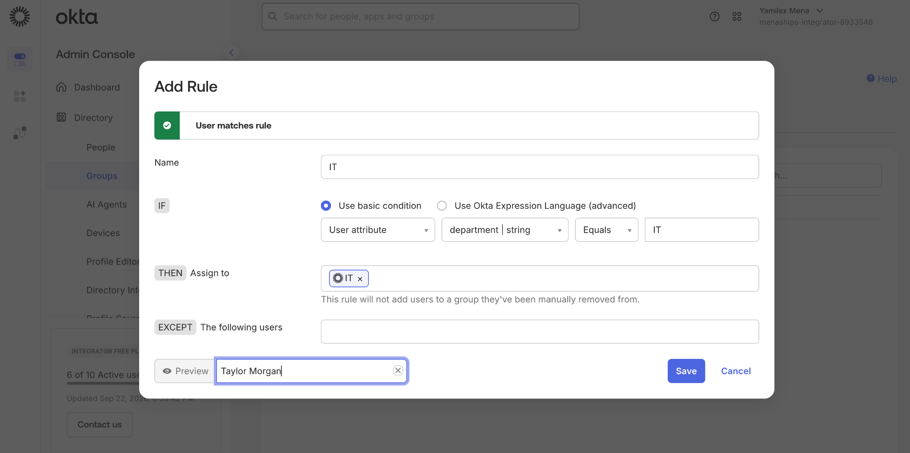
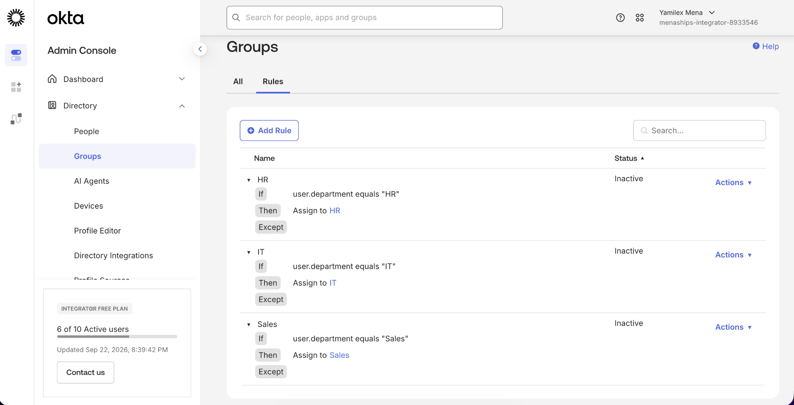
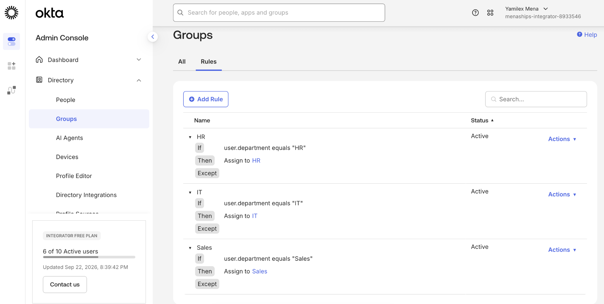
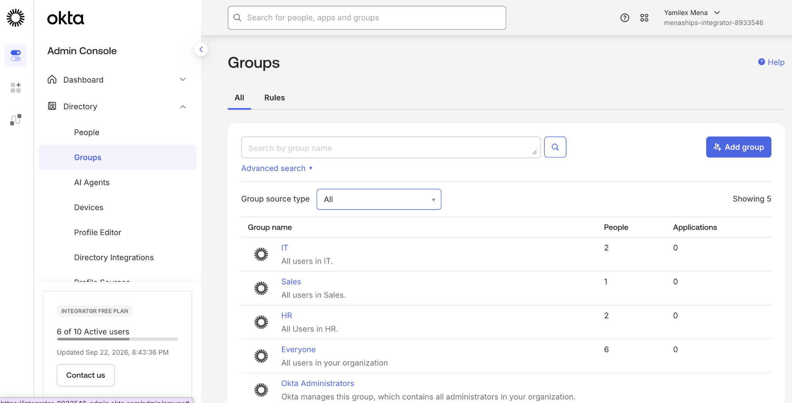

# Attribute-Based Access Control (ABAC) - Rules

## Objective

Create attribute-based group rules in Okta so users are automatically assigned to department groups based on their profile attributes.

## Step 1: Review Group Rules

Reviewed the Okta group rules area before creating any automated membership rules.

## Step 2: Configure a Department-Based Rule

Created an IT rule using the user's **Department** attribute. Users whose department equals **IT** are assigned to the IT group.

## Step 3: Preview the Rule

Used the rule preview to confirm that Taylor Morgan matched the IT department rule.

## Step 4: Activate Department Rules

Created and activated department-based rules for **HR**, **IT**, and **Sales**.

## Step 5: Verify User Group Membership

Verified that Taylor Morgan was automatically assigned to the IT group and that the membership was managed by the IT rule.

## Step 6: Verify Group Membership Results

Reviewed the Groups page and confirmed that the department groups contained users after the rules were applied.

## Skills Demonstrated

- Okta Administration
- Attribute-Based Access Control (ABAC)
- Group Rules
- Automated Group Assignment
- User Attribute Management
- Identity and Access Management
